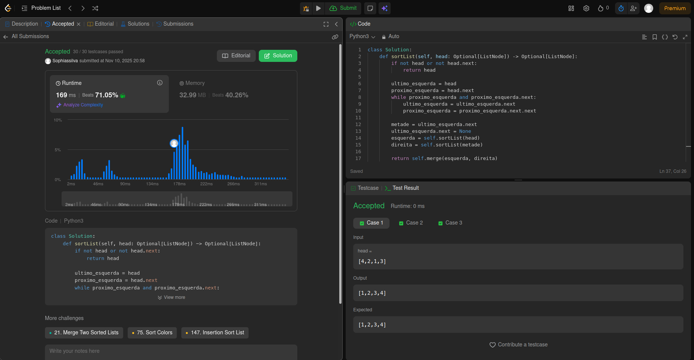
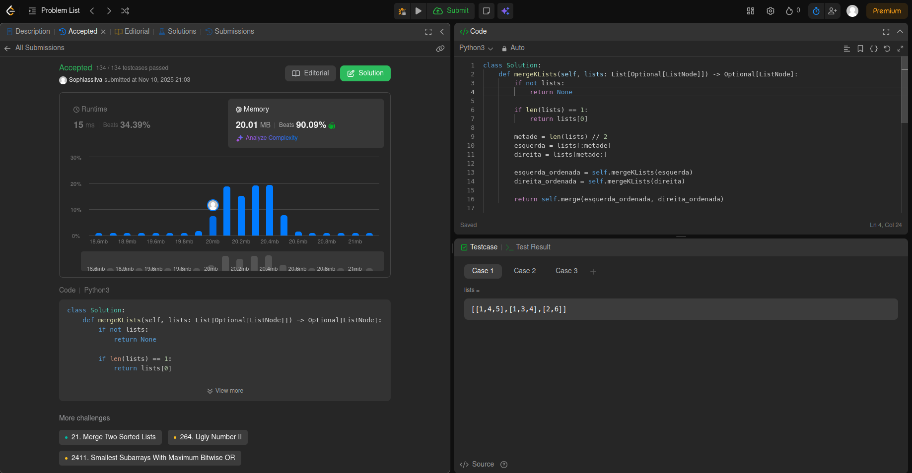
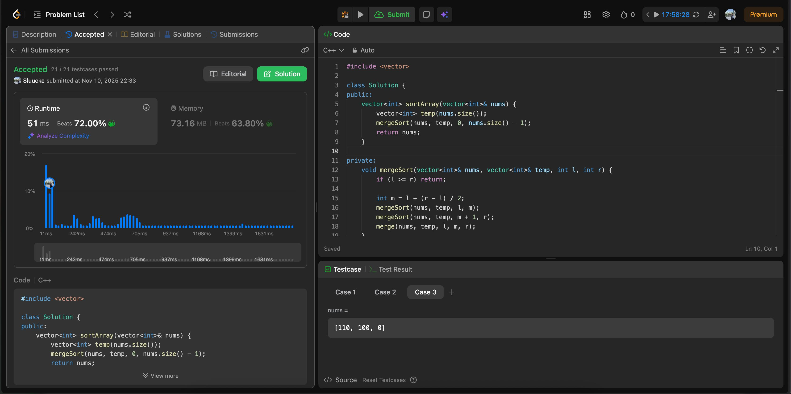

# Dividir e conquistar

**Número do trabalho:** 4  
**Conteúdo: Dividir e conquistar**

## Discentes

| Matrícula |        Nome Completo         |
|:---------:|:----------------------------:|
| 232001649 | David William Lemos Ferreira |
| 231026886 | Sophia Souza da Silva        |

## Definição do Trabalho

Para este segundo trabalho, decidimos resolver questões do leetcode.

## Linguagens utilizadas

Utilizamos as linguagens C++ e Python para resolução das questões.

## Questões

| Questão | Nível  |
|---------|--------|
| [148 - Sort list](https://leetcode.com/problems/sort-list/description/) | Médio |
| [23 - Merge K sorted lists](https://leetcode.com/problems/merge-k-sorted-lists/description/) | Difícil |
| [912. Sort an Array](https://leetcode.com/problems/sort-an-array) | Médio |
| [1655. Distribute Repeating Integers](https://leetcode.com/problems/distribute-repeating-integers) | Difícil |

## Screenshots

### Exercício 01 - Sort List

### Exercício 02 - Merge K sorted lists

### Exercício 03 -

### Exercício 04 -

## Vídeo
